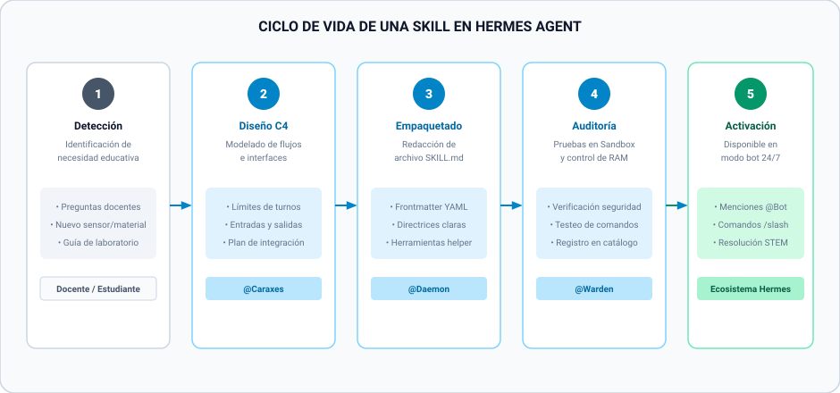
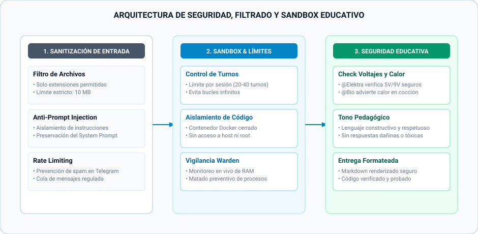

<p align="center">
  
</p>

<p align="center">
  <b>Plataforma de Asistencia Inteligente y Mentoría Autónoma para Laboratorios Educativos y Maker Spaces</b>
</p>

<p align="center">
  
  
  
  
  
</p>

<p align="center">
  
  
  
  
  
  
  
</p>

<p align="center">
  <a href="#-visión-general"><b>Visión General</b></a> •
  <a href="#-recursos-educativos-destacados"><b>Recursos Educativos</b></a> •
  <a href="#-clusters-de-agentes"><b>Clusters</b></a> •
  <a href="#-diagramas-avanzados-de-arquitectura"><b>Arquitectura</b></a> •
  <a href="#-guía-de-interacción-en-modo-bot"><b>Modo Bot</b></a> •
  <a href="CONTRIBUTING.md"><b>Contribuir</b></a>
</p>

---

## 🌟 Visión General

**Raspy_Hermes** es un ecosistema educativo compuesto por **8 agentes de IA autónomos** basados en el motor de **Hermes Agent**. Los agentes están diseñados para apoyar el aprendizaje basado en proyectos en entornos educativos y laboratorios Maker STEM, facilitando la resolución de dudas sobre **Impresión 3D**, **Electrónica**, **Bioplásticos**, **Arquitectura de Sistemas** y **Orquestación**.

Los usuarios (estudiantes, docentes y entusiastas) interactúan con la red de bots en plataformas de mensajería (Telegram y Discord) mediante la sintaxis `@NombreAgent` o comandos `/slash`.

---

## 📚 Recursos Educativos Destacados

Para sacar el máximo provecho al laboratorio y comprender en profundidad el funcionamiento del ecosistema, consulta nuestras guías especializadas:

| Recurso | Destinatario | Descripción | Enlace |
| :--- | :--- | :--- | :--- |
| **📚 Diccionario de Skills** | Desarrolladores / Docentes | Catálogo técnico de las 8 habilidades nativas y herramientas auxiliares del sistema. | [📘 Ver Diccionario](docs/referencias/diccionario_skills.md) |
| **🔄 Ciclo de Vida de Skills** | Arquitectos / Creadores | Fases de diseño, empaquetado, validación y activación de habilidades. | [📘 Ver Ciclo de Vida](docs/referencias/ciclo_vida_skills.md) |
| **🛡️ Arquitectura de Seguridad** | Administradores / IT | Mecanismos de sanitización, rate limiting, control de turnos y sandbox. | [📘 Ver Seguridad](docs/referencias/arquitectura_seguridad.md) |
| **🍎 Guía Metodológica para Docentes** | Profesores / UTP | Matriz de Objetivos de Aprendizaje Transversales STEM, metodología ABP y rúbrica. | [📘 Ver Guía](docs/pedagogia/guias_docentes.md) |
| **🚀 Manual de Interacción** | Estudiantes / Usuarios | Guía paso a paso sobre cómo redactar consultas efectivas y normas de etiqueta. | [📘 Ver Manual](docs/pedagogia/guia_interaccion_estudiantes.md) |
| **💡 Casos de Uso Reales** | Docentes y Alumnos | Proyectos integrados desglosados paso a paso (Maceta Inteligente, Brazo Robótico). | [📘 Ver Casos](docs/pedagogia/casos_de_uso.md) |
| **📖 Glosario Técnico STEM** | Comunidad | Definición sencilla de términos sobre Impresión 3D, Arduino, Bioplásticos e IA. | [📘 Ver Glosario](docs/referencias/glosario_stem.md) |

---

## 🏛️ Diagrama del Ecosistema


---

## 📊 Diagramas Avanzados de Arquitectura

<details open>
<summary>🔍 <b>Haz clic para expandir / colapsar los diagramas técnicos de arquitectura</b></summary>

<br>

### 1. Diagrama de Secuencia UML — Traza de Mensajería y Enrutamiento
Muestra el recorrido temporal de un mensaje desde que se envía en Telegram hasta la respuesta del modelo:


### 2. Ciclo de Vida de una Skill en Hermes Agent
Proceso metódico en 5 pasos para crear, validar y activar nuevas habilidades en el sistema:


### 3. Arquitectura de Seguridad, Filtrado y Sandbox Educativo
Mecanismos multicapa para proteger la integridad del aula y la infraestructura técnica:


### 4. Matriz de Habilidades y Herramientas por Agente
Mapeo exhaustivo de las herramientas asociadas a cada archivo `SKILL.md` del ecosistema:


### 5. Mapa de Colaboración Inter-Cluster
Demuestra cómo colaboran los tres clusters durante el desarrollo de un proyecto escolar integrado:


</details>

---

## 🤖 Clusters de Agentes

Los 8 agentes están distribuidos estratégicamente en **3 clusters funcionales**:

### 🟢 1. Cluster Dominio (STEM)

| Agente | Alias / Trigger | Rol Principal | Documentación | Diagrama de Flujo |
| :--- | :--- | :--- | :--- | :--- |
| **Maestro Capa** | `@Capa` <br> `/capa` | Experto en impresión 3D, análisis STL y optimización cero residuos | [📘 Ver Doc](docs/agentes/capa.md) |  |
| **Elektra** | `@Elektra` <br> `@Chispa` <br> `/elektra` | Experta en electrónica, microcontroladores Arduino/ESP32 y circuitos | [📘 Ver Doc](docs/agentes/elektra.md) |  |
| **Bio** | `@Bio` <br> `/bio` | Mentor de bioplásticos, química verde y economía circular | [📘 Ver Doc](docs/agentes/bio.md) |  |

---

### 🔵 2. Cluster Infraestructura

| Agente | Trigger | Rol Principal | Documentación | Diagrama de Flujo |
| :--- | :--- | :--- | :--- | :--- |
| **Caraxes** | `@Caraxes` <br> `/caraxes` | Arquitecto de skills y modelado de arquitecturas C4/D2 | [📘 Ver Doc](docs/agentes/caraxes.md) |  |
| **Daemon** | `@Daemon` <br> `/daemon` | Creador y artesano de habilidades (`SKILL.md`) | [📘 Ver Doc](docs/agentes/daemon.md) |  |
| **Warden** | `@Warden` <br> `/warden` | Guardián del sistema, monitoreo de salud (RAM/CPU) y seguridad | [📘 Ver Doc](docs/agentes/warden.md) |  |

---

### 🟣 3. Cluster Orquestación

| Agente | Trigger | Rol Principal | Documentación | Diagrama de Flujo |
| :--- | :--- | :--- | :--- | :--- |
| **Master** | `@Master` <br> `/master` | Orquestador de proyectos multidisciplinarios y resolución de bloqueos | [📘 Ver Doc](docs/agentes/master.md) |  |
| **TutorConversion** | `@TutorConversion` <br> `/tutor_conversion` | Conversor pedagógico de guías pasivas PDF a bots interactivos | [📘 Ver Doc](docs/agentes/tutor_conversion.md) |  |

---

## 💬 Guía de Interacción en Modo Bot

<details>
<summary>👉 <b>Haz clic aquí para ver ejemplos de preguntas y comandos en Telegram/Discord</b></summary>

<br>

#### 🖨️ Mención a @Capa:
```text
@Capa ¿Cuál es la temperatura óptima para imprimir PLA en una Ender 3?
```
> **Respuesta:** Parámetros exactos (Extrusor: 205°C, Cama: 55°C, Velocidad: 50mm/s), análisis de adherencia y tips de cero residuos.

#### ⚡ Mención a @Elektra:
```text
@Elektra ¿Cómo conecto una fotoresistencia LDR a un Arduino para encender un LED?
```
> **Respuesta:** Diagrama ASCII de conexiones, ley de Ohm explicada de forma sencilla y código `.ino` comentado listo para subir.

#### 🌿 Mención a @Bio:
```text
@Bio ¿Cómo podemos hacer bioplástico flexible con almidón de maíz en el laboratorio?
```
> **Respuesta:** Receta con proporciones exactas en gramos/ml, tiempos de secado y estimación de biodegradación.

#### 🎯 Mención a @Master:
```text
@Master Queremos diseñar una estación meteorológica escolar con carcasa 3D y sensores solares. ¿Cómo nos organizamos?
```
> **Respuesta:** Desglose del proyecto en 3 fases asignando tareas específicas a `@Capa`, `@Elektra` y `@Bio`.

</details>

---

## 📂 Estructura Modular del Repositorio

```
Raspy_Hermes/
├── README.md                           # Presentación principal del proyecto
├── CONTRIBUTING.md                     # Guía para proponer skills y contribuir
├── diagrams/                           # 14 diagramas vectoriales en formato SVG
│   ├── ecosistema_general.svg          # Mapa general del ecosistema
│   ├── secuencia_interaccion.svg       # Diagrama de Secuencia UML de mensajería
│   ├── ciclo_vida_skill.svg            # Ciclo de vida de una skill en Hermes
│   ├── seguridad_sandbox.svg           # Arquitectura de seguridad y sandbox
│   ├── mapa_habilidades_skills.svg     # Matriz de herramientas y skills por agente
│   ├── matriz_clusters_stem.svg        # Mapa de colaboración inter-cluster
│   ├── capa_flujo.svg                  # Flujo de Maestro Capa
│   ├── elektra_flujo.svg               # Flujo de Elektra
│   ├── bio_flujo.svg                   # Flujo de Bio
│   ├── caraxes_flujo.svg               # Flujo de Caraxes
│   ├── daemon_flujo.svg                # Flujo de Daemon
│   ├── warden_flujo.svg                # Flujo de Warden
│   ├── master_flujo.svg                # Flujo de Master
│   └── tutor_conversion_flujo.svg      # Flujo de TutorConversion
└── docs/                               # Documentación organizada por subcarpetas
    ├── agentes/                        # Fichas técnicas de los 8 agentes de IA
    │   ├── capa.md
    │   ├── elektra.md
    │   ├── bio.md
    │   ├── caraxes.md
    │   ├── daemon.md
    │   ├── warden.md
    │   ├── master.md
    │   └── tutor_conversion.md
    ├── pedagogia/                      # Guías educativas, metodológicas y casos
    │   ├── guias_docentes.md
    │   ├── guia_interaccion_estudiantes.md
    │   └── casos_de_uso.md
    └── referencias/                    # Catálogos técnicos y arquitectura
        ├── diccionario_skills.md
        ├── ciclo_vida_skills.md
        ├── arquitectura_seguridad.md
        └── glosario_stem.md
```

---

<p align="center">
  <a href="https://github.com/zebas-hidalgo/Raspy_Hermes/stargazers">
    
  </a>
  <a href="https://github.com/zebas-hidalgo/Raspy_Hermes/network/members">
    
  </a>
</p>

<p align="center">
  <sub>Desarrollado con ❤️ para el ecosistema <b>Kronos_School</b> con <b>Hermes Agent</b> • Licencia MIT</sub>
</p>
